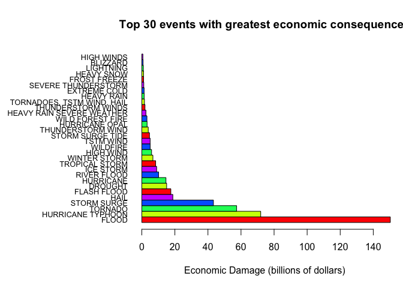
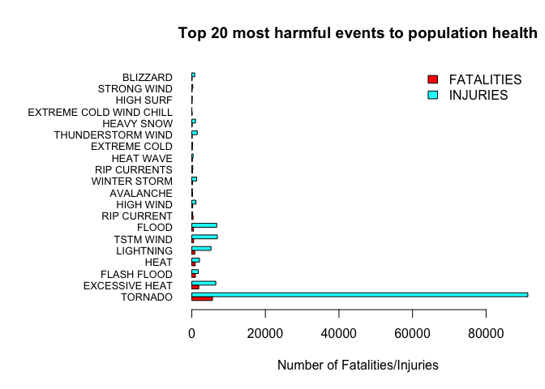
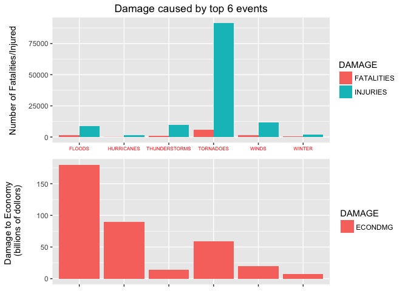

# Weather Events with Major Impact on Public Health and Economy


### Synopsis: 
##### The weather data from NOAA for the years between 1950 and 2011 has been analysed to identify the the events that caused the most damage to the economy and the public health across the United States of America. The initial dataset has been subjected to a set of procedures to address some inconsistencies in the way the event types were recorded. A set of tests have been performed to confirm that the new dataset produced after the cleanup does not require any further cleanup to determine the events that caused the most damage. Out of 476 billion dollars of total economic damage from all events, the damage caused by the floods with about 180 billion dollars tobs the list followed by the damage casued by hurricanes and tornadoes. The tornadoes were responsible for the most number of fatalities and injuries.

## Data Processing:
##### 1. Enable cache on all chunks to avoid redoing the steps if the objects did not change 
##### 2. Download StormData.csv.bz2 fomr url if it doesn't exist in the current directory
##### 3. Uncompress the file using bunzip2 if it is not uncompressed already
##### 4. Read StormData.csv into stormdata data frame
##### 5. Check summary of stormdata to understand the soruce data before transformation
##### 6. Build dbgexpkv refrence data frame with damage exponent and its value
##### 7. Create stormdata.econ by subsetting stormdata with observations that do not have zeros for both PROPDMG and CROPDMG
#####    and selecing EVTYPE and PROPDMG, PROPDMGEXP, CROPDMG, CROPDMGEXP columns
##### 8. Merge dbgexpkv into stormdata.econ to add exponent value column 
##### 9. Create stormdata.econdmg by mutating EVTYPE to replce '/' with ' ' and to convert all event types to upper case.
##### 10. Calculate total damage for each type, aggregate on EVTYPE, and arrange ECONDMG in descending order
##### 11. Display summary on stormdata.econdmg and create a barplot for top 30 event types
#####  
##### 12. Identify key words representing the events from top of the barplot above.
#####     FLOOD/FLOODING HURRICANE TORNADOES WIND/WND THUNDERSTORM/TSTM WINT/WINTER
##### 13. Aggregate on EVTYPE with above keywords to get individual total damage
##### 14. Compare above totals against the top 6 on the barplot
##### 
##### 15. Create stormdata.health by subsetting stormdata with observations that do not have zeros for both FATALITIES and INJURIES
#####     and selecting EVTYPE, FATALITIES, and INJURIES columsn
##### 16. Aggregate FATALITIES and INJURIES by EVTYPE and arrange FATALITIES in descending order
##### 17. Display summary and create a bar plot for the top 20 events
##### 18. Calculate number of FATALITIES and INJURIES for each event type identified in step 12.
##### 19. Build stormdata.top6 data frame from ECONDMG from step 13 and FATALITIES/INJURIES from step 18
##### 20. Create stormdata.top6.econ and stormdata.top6.health from stormdata.top6
##### 21. Create bar plots from stormdata.top6.health and stormdata.top6.econ on the same grid.

#### Loading and Preprocessing the Data:

```r
usePackage("stats")
usePackage("R.utils")
usePackage("dtplyr")
usePackage("ggplot2")
usePackage("grid")
```

```
## Loading required package: grid
```

```r
# source
sourceURL<-"https://d396qusza40orc.cloudfront.net/repdata%2Fdata%2FStormData.csv.bz2"
sourceFileCompressed<-"StormData.csv.bz2"
sourceFile<-"StormData.csv"

start_time <- Sys.time()

# downlod the compressed file if it doesn't exist in the current directory
if (!file.exists(sourceFileCompressed)) {
  download.file(sourceURL, destfile = sourceFileCompressed, mode = "wb")
  print(paste0("It took ", Sys.time() - start_time, " to download ", sourceFileCompressed, "."), quote = FALSE)
}

start_time <- Sys.time()

# if not uncompressed already
if (!file.exists(sourceFile)) {
  bunzip2(sourceFileCompressed, overwrite = T, remove = FALSE)
  print(paste0("It took ", Sys.time() - start_time, " to uncompress ", sourceFileCompressed, "."), quote = FALSE)
}

start_time <- Sys.time()

# read the file into a data frame
if (file.exists(sourceFile)) {
    stormdata <- read.csv(sourceFile, sep = ",", header = TRUE)
    # print "Skip reading the file..."
    print(paste0("It took ", Sys.time() - start_time, " to read ", sourceFile, "."), quote = FALSE)
} else {
  print(paste0(sourceFile, " does not exist!"), quote = FALSE)
  exit (-1)
}
```

```
## [1] It took 1.73635999759038 to read StormData.csv.
```


## Data Transformation and Analysis:

```r
ls()
```

```
## [1] "sourceFile"           "sourceFileCompressed" "sourceURL"           
## [4] "start_time"           "stormdata"            "usePackage"
```

```r
summary(stormdata)
```

```
##     STATE__                  BGN_DATE             BGN_TIME     
##  Min.   : 1.0   5/25/2011 0:00:00:  1202   12:00:00 AM: 10163  
##  1st Qu.:19.0   4/27/2011 0:00:00:  1193   06:00:00 PM:  7350  
##  Median :30.0   6/9/2011 0:00:00 :  1030   04:00:00 PM:  7261  
##  Mean   :31.2   5/30/2004 0:00:00:  1016   05:00:00 PM:  6891  
##  3rd Qu.:45.0   4/4/2011 0:00:00 :  1009   12:00:00 PM:  6703  
##  Max.   :95.0   4/2/2006 0:00:00 :   981   03:00:00 PM:  6700  
##                 (Other)          :895866   (Other)    :857229  
##    TIME_ZONE          COUNTY           COUNTYNAME         STATE       
##  CST    :547493   Min.   :  0.0   JEFFERSON :  7840   TX     : 83728  
##  EST    :245558   1st Qu.: 31.0   WASHINGTON:  7603   KS     : 53440  
##  MST    : 68390   Median : 75.0   JACKSON   :  6660   OK     : 46802  
##  PST    : 28302   Mean   :100.6   FRANKLIN  :  6256   MO     : 35648  
##  AST    :  6360   3rd Qu.:131.0   LINCOLN   :  5937   IA     : 31069  
##  HST    :  2563   Max.   :873.0   MADISON   :  5632   NE     : 30271  
##  (Other):  3631                   (Other)   :862369   (Other):621339  
##                EVTYPE         BGN_RANGE           BGN_AZI      
##  HAIL             :288661   Min.   :   0.000          :547332  
##  TSTM WIND        :219940   1st Qu.:   0.000   N      : 86752  
##  THUNDERSTORM WIND: 82563   Median :   0.000   W      : 38446  
##  TORNADO          : 60652   Mean   :   1.484   S      : 37558  
##  FLASH FLOOD      : 54277   3rd Qu.:   1.000   E      : 33178  
##  FLOOD            : 25326   Max.   :3749.000   NW     : 24041  
##  (Other)          :170878                      (Other):134990  
##          BGN_LOCATI                  END_DATE             END_TIME     
##               :287743                    :243411              :238978  
##  COUNTYWIDE   : 19680   4/27/2011 0:00:00:  1214   06:00:00 PM:  9802  
##  Countywide   :   993   5/25/2011 0:00:00:  1196   05:00:00 PM:  8314  
##  SPRINGFIELD  :   843   6/9/2011 0:00:00 :  1021   04:00:00 PM:  8104  
##  SOUTH PORTION:   810   4/4/2011 0:00:00 :  1007   12:00:00 PM:  7483  
##  NORTH PORTION:   784   5/30/2004 0:00:00:   998   11:59:00 PM:  7184  
##  (Other)      :591444   (Other)          :653450   (Other)    :622432  
##    COUNTY_END COUNTYENDN       END_RANGE           END_AZI      
##  Min.   :0    Mode:logical   Min.   :  0.0000          :724837  
##  1st Qu.:0    NA's:902297    1st Qu.:  0.0000   N      : 28082  
##  Median :0                   Median :  0.0000   S      : 22510  
##  Mean   :0                   Mean   :  0.9862   W      : 20119  
##  3rd Qu.:0                   3rd Qu.:  0.0000   E      : 20047  
##  Max.   :0                   Max.   :925.0000   NE     : 14606  
##                                                 (Other): 72096  
##            END_LOCATI         LENGTH              WIDTH         
##                 :499225   Min.   :   0.0000   Min.   :   0.000  
##  COUNTYWIDE     : 19731   1st Qu.:   0.0000   1st Qu.:   0.000  
##  SOUTH PORTION  :   833   Median :   0.0000   Median :   0.000  
##  NORTH PORTION  :   780   Mean   :   0.2301   Mean   :   7.503  
##  CENTRAL PORTION:   617   3rd Qu.:   0.0000   3rd Qu.:   0.000  
##  SPRINGFIELD    :   575   Max.   :2315.0000   Max.   :4400.000  
##  (Other)        :380536                                         
##        F               MAG            FATALITIES          INJURIES        
##  Min.   :0.0      Min.   :    0.0   Min.   :  0.0000   Min.   :   0.0000  
##  1st Qu.:0.0      1st Qu.:    0.0   1st Qu.:  0.0000   1st Qu.:   0.0000  
##  Median :1.0      Median :   50.0   Median :  0.0000   Median :   0.0000  
##  Mean   :0.9      Mean   :   46.9   Mean   :  0.0168   Mean   :   0.1557  
##  3rd Qu.:1.0      3rd Qu.:   75.0   3rd Qu.:  0.0000   3rd Qu.:   0.0000  
##  Max.   :5.0      Max.   :22000.0   Max.   :583.0000   Max.   :1700.0000  
##  NA's   :843563                                                           
##     PROPDMG          PROPDMGEXP        CROPDMG          CROPDMGEXP    
##  Min.   :   0.00          :465934   Min.   :  0.000          :618413  
##  1st Qu.:   0.00   K      :424665   1st Qu.:  0.000   K      :281832  
##  Median :   0.00   M      : 11330   Median :  0.000   M      :  1994  
##  Mean   :  12.06   0      :   216   Mean   :  1.527   k      :    21  
##  3rd Qu.:   0.50   B      :    40   3rd Qu.:  0.000   0      :    19  
##  Max.   :5000.00   5      :    28   Max.   :990.000   B      :     9  
##                    (Other):    84                     (Other):     9  
##       WFO                                       STATEOFFIC    
##         :142069                                      :248769  
##  OUN    : 17393   TEXAS, North                       : 12193  
##  JAN    : 13889   ARKANSAS, Central and North Central: 11738  
##  LWX    : 13174   IOWA, Central                      : 11345  
##  PHI    : 12551   KANSAS, Southwest                  : 11212  
##  TSA    : 12483   GEORGIA, North and Central         : 11120  
##  (Other):690738   (Other)                            :595920  
##                                                                                                                                                                                                     ZONENAMES     
##                                                                                                                                                                                                          :594029  
##                                                                                                                                                                                                          :205988  
##  GREATER RENO / CARSON CITY / M - GREATER RENO / CARSON CITY / M                                                                                                                                         :   639  
##  GREATER LAKE TAHOE AREA - GREATER LAKE TAHOE AREA                                                                                                                                                       :   592  
##  JEFFERSON - JEFFERSON                                                                                                                                                                                   :   303  
##  MADISON - MADISON                                                                                                                                                                                       :   302  
##  (Other)                                                                                                                                                                                                 :100444  
##     LATITUDE      LONGITUDE        LATITUDE_E     LONGITUDE_    
##  Min.   :   0   Min.   :-14451   Min.   :   0   Min.   :-14455  
##  1st Qu.:2802   1st Qu.:  7247   1st Qu.:   0   1st Qu.:     0  
##  Median :3540   Median :  8707   Median :   0   Median :     0  
##  Mean   :2875   Mean   :  6940   Mean   :1452   Mean   :  3509  
##  3rd Qu.:4019   3rd Qu.:  9605   3rd Qu.:3549   3rd Qu.:  8735  
##  Max.   :9706   Max.   : 17124   Max.   :9706   Max.   :106220  
##  NA's   :47                      NA's   :40                     
##                                            REMARKS           REFNUM      
##                                                :287433   Min.   :     1  
##                                                : 24013   1st Qu.:225575  
##  Trees down.\n                                 :  1110   Median :451149  
##  Several trees were blown down.\n              :   568   Mean   :451149  
##  Trees were downed.\n                          :   446   3rd Qu.:676723  
##  Large trees and power lines were blown down.\n:   432   Max.   :902297  
##  (Other)                                       :588295
```

```r
library(grid)

#  Based on  the articale "How To Handle Exponent Value of PROPDMGEXP and CROPDMGEXP" at
# https://rstudio-pubs-static.s3.amazonaws.com/58957_37b6723ee52b455990e149edde45e5b6.html
# create reference table for exponents used and the corresponding multipliers
dmgexpkv = data.table(x=c("", "-", "?", "+", 0, seq(1:8), "H", "h", "K","k","M","m","B","b")
                      , y=c(0,0,0,1,rep(10,9),100,100,1000,1000,1000000,1000000,1000000000,1000000000))
names(dmgexpkv) <- c("PROPDMGEXP", "PROPDMGEXPVAL")
#

# Consider observarions for which both PROPDMG and CROPDMG are not 0
stormdata.econ <- subset(stormdata, !(PROPDMG==0 & CROPDMG==0), select = c(EVTYPE, PROPDMG, PROPDMGEXP, CROPDMG, CROPDMGEXP))
#
# merge to get PROPDBMGEXPVAL column added to stormdata.econ
stormdata.econ <- merge(stormdata.econ, dmgexpkv, by.x = "PROPDMGEXP", by.y = "PROPDMGEXP")
#
# merge to get CROPDBMGEXPVAL column added to stormdata.econ
names(dmgexpkv) <- c("CROPDMGEXP", "CROPDMGEXPVAL")
stormdata.econ <- merge(stormdata.econ, dmgexpkv, by.x = "CROPDMGEXP", by.y = "CROPDMGEXP")
#
# Calculate total damage for each event
stormdata.econdmg <- stormdata.econ %>% mutate(EVTYPE = gsub("/", " ", toupper(EVTYPE)), ECONDMG = PROPDMG*PROPDMGEXPVAL+CROPDMG*CROPDMGEXPVAL) %>% select(EVTYPE,ECONDMG)
```

```
## Warning: failed to assign NativeSymbolInfo for env since env is already
## defined in the 'lazyeval' namespace
```

```r
# sum/aggreate the damage by EVTYPE
stormdata.econdmg <- aggregate(ECONDMG ~ EVTYPE, data = stormdata.econdmg, FUN = 'sum') %>% arrange(desc(ECONDMG))
#
dim(stormdata.econdmg)
```

```
## [1] 390   2
```

```r
summary(stormdata.econdmg)
```

```
##     EVTYPE             ECONDMG         
##  Length:390         Min.   :0.000e+00  
##  Class :character   1st Qu.:1.512e+04  
##  Mode  :character   Median :3.556e+05  
##                     Mean   :1.222e+09  
##                     3rd Qu.:7.532e+06  
##                     Max.   :1.503e+11
```

```r
#
# have enough left margin for event type lables
par(mar = c(5,12,4,1) + 0.1)
# plot economic damage in billions of dollars for top 30 events 
barplot(as.matrix(head(stormdata.econdmg$ECONDMG/1000000000,30))
        , beside = TRUE
        , col=rainbow(5)
        , horiz = TRUE
        , names.arg = head(stormdata.econdmg$EVTYPE,30)
        , cex.names = 0.8
        , las = 1
        , xlab = "Economic Damage (billions of dollars)" 
        , main = "Top 30 events with greatest economic consequences"
        , xpd = TRUE)
```

<!-- -->

```r
# Check totals by event types that have the keywords associated with most common major severe events
# FLOOD/FLOODING
# HURRICANE
# TORNADOES
# WIND/WND
# THUNDERSTORM/TSTM
# WINT/WINTER
#
flood <- round(sum(stormdata.econdmg[grep("FLOOD", stormdata.econdmg$EVTYPE),2])/1000000000)
hurric <- round(sum(stormdata.econdmg[grep("HURRIC", stormdata.econdmg$EVTYPE),2])/1000000000)
tornado <- round(sum(stormdata.econdmg[grep("TORN", stormdata.econdmg$EVTYPE),2])/1000000000)
wind <- round(sum(stormdata.econdmg[grep("WIND|WND", stormdata.econdmg$EVTYPE),2])/1000000000)
tstm <- round(sum(stormdata.econdmg[grep("THUNDERSTORM|TSTM|THUNDER", stormdata.econdmg$EVTYPE),2])/1000000000)
winter <- round(sum(stormdata.econdmg[grep("WINTER", stormdata.econdmg$EVTYPE),2])/1000000000)

print("Total damage in billions of dollars for the top 6 event catagories :", quote = FALSE)
```

```
## [1] Total damage in billions of dollars for the top 6 event catagories :
```

```r
cat(  "floods           :", flood
    , "\nhurricanes       : ", hurric
    , "\ntornadoes        : ", tornado
    , "\nwinds            : ", wind
    , "\nthunderstorms    : ", tstm
    , "\nwinter           :  ", winter)
```

```
## floods           : 180 
## hurricanes       :  90 
## tornadoes        :  59 
## winds            :  20 
## thunderstorms    :  14 
## winter           :   7
```

```r
### consider observarions for which both PROPDMGEXP and CROPDMGEXP are not 0
# 
stormdata.health <- subset(stormdata, !(FATALITIES==0 & INJURIES==0), select = c(EVTYPE, FATALITIES, INJURIES)) %>% mutate (EVTYPE = gsub("/", " ", toupper(EVTYPE)))

stormdata.health <- aggregate(cbind(FATALITIES, INJURIES) ~ EVTYPE, data = stormdata.health, FUN = 'sum') %>% arrange(desc(FATALITIES), desc(INJURIES))

# summary
summary(stormdata.health)
```

```
##     EVTYPE            FATALITIES         INJURIES      
##  Length:203         Min.   :   0.00   Min.   :    0.0  
##  Class :character   1st Qu.:   1.00   1st Qu.:    0.0  
##  Mode  :character   Median :   2.00   Median :    3.0  
##                     Mean   :  74.61   Mean   :  692.3  
##                     3rd Qu.:  13.50   3rd Qu.:   39.0  
##                     Max.   :5633.00   Max.   :91346.0
```

```r
stormdata.health.matrix <- t(head(stormdata.health,20)[-1])
colnames(stormdata.health.matrix) <- head(stormdata.health,20)[, 1]
# plot health damage for top 30 events 
barplot(stormdata.health.matrix
        , beside = TRUE
        , col=rainbow(2)
        , horiz = TRUE
        , names.arg = colnames(stormdata.health.matrix)
        , cex.names = 0.8
        , las = 1
        , xlab = "Number of Fatalities/Injuries" 
        , main = "Top 20 most harmful events to population health"
        , xpd = TRUE)

legend("topright", c("FATALITIES", "INJURIES"), cex=1.0, bty="n", fill=rainbow(2))
```

<!-- -->

```r
# 
flood.f <- sum(stormdata.health[grep("FLOOD", stormdata.health$EVTYPE),2])
flood.i <- sum(stormdata.health[grep("FLOOD", stormdata.health$EVTYPE),3])
hurric.f <- sum(stormdata.health[grep("HURRIC", stormdata.health$EVTYPE),2])
hurric.i <- sum(stormdata.health[grep("HURRIC", stormdata.health$EVTYPE),3])
tornado.f <- sum(stormdata.health[grep("TORN", stormdata.health$EVTYPE),2])
tornado.i <- sum(stormdata.health[grep("TORN", stormdata.health$EVTYPE),3])
wind.f <- sum(stormdata.health[grep("WIND|WND", stormdata.health$EVTYPE),2])
wind.i <- sum(stormdata.health[grep("WIND|WND", stormdata.health$EVTYPE),3])
tstm.f <- sum(stormdata.health[grep("THUNDERSTORM|TSTM|THUNDER", stormdata.health$EVTYPE),2])
tstm.i <- sum(stormdata.health[grep("THUNDERSTORM|TSTM|THUNDER", stormdata.health$EVTYPE),3])
winter.f <- sum(stormdata.health[grep("WINTER", stormdata.health$EVTYPE),2])
winter.i <- sum(stormdata.health[grep("WINTER", stormdata.health$EVTYPE),3])

stormdata.top6 <- data.frame(c("FLOODS", "HURRICANES", "TORNADOES", "WINDS", "THUNDERSTORMS", "WINTER")
                   ,c(flood, hurric, tornado, wind, tstm, winter)
                   ,c(flood.f, hurric.f, tornado.f, wind.f, tstm.f, winter.f)
                   ,c(flood.i, hurric.i, tornado.i, wind.i, tstm.i, winter.i))

names(stormdata.top6) <- c("EVTYPE", "ECONDMG", "FATALITIES", "INJURIES")

stormdata.top6.health <- subset(stormdata.top6, select = c(EVTYPE, FATALITIES, INJURIES))
stormdata.top6.econ <- subset(stormdata.top6, select = c(EVTYPE, ECONDMG))

stormdata.top6.health.melt <- melt(stormdata.top6.health)
```

```
## Using EVTYPE as id variables
```

```r
stormdata.top6.econ.melt <- melt(stormdata.top6.econ)
```

```
## Using EVTYPE as id variables
```

```r
names(stormdata.top6.health.melt) <- c("EVTYPE", "DAMAGE", "DAMAGEVAL")
names(stormdata.top6.econ.melt) <- c("EVTYPE", "DAMAGE", "DAMAGEVAL")

plot1 <- 
  ggplot(stormdata.top6.health.melt) +
  geom_bar(aes(x = EVTYPE , y = DAMAGEVAL, fill = DAMAGE), stat="identity", position="dodge") +
  labs(title = "Damage caused by top 6 events") + 
  ylab("Number of Fatalities/Injured") +
  theme(axis.title.y=element_text(margin=margin(0,20,0,0))) +
  theme(axis.text.x=element_text(size=6, color="red")) +
  theme(panel.margin.y = unit(10, "lines")) +
  theme(axis.title.x = element_blank())

plot2 <- 
  ggplot(stormdata.top6.econ.melt) +
  geom_bar(aes(x = EVTYPE, y = DAMAGEVAL, fill = DAMAGE), stat="identity") +
  ylab("Damage to Economy \n (billions of dollors)") +
  theme(panel.margin.y = unit(10, "lines")) +
  theme(axis.title.y=element_text(margin=margin(0,20,0,0))) +
  theme(axis.text.x=element_blank()) +
  theme(axis.title.x = element_blank())

grid.newpage()
grid.draw(rbind(ggplotGrob(plot1), ggplotGrob(plot2), size = "last"))
```

<!-- -->

## Analysis:
#### The first plot depicts the economic damage estimates for the top 30 event types. Further cleaning of the data to fix typos and other issues proved unnecessary as the damage contributed by the rest of the event types will not alter the position/rank of the top 5 event types.
#### The second plot depicts the number of fatalities and injured for the top 20 event types. The counts for the rest of the event types are negligible. 
#### The third plot depicts the economoic damage and the fatalities/injuries casued by the top 6 event types. They are shown one above the other in the same grid for comparison.

## Results:
#### The analysis finds that FLOODING causes the most economic damage (~180 billion dollars) of all event tyeps where as tornodoes cause the most damage to the humans (5661 fatalities/91407 injuries).
